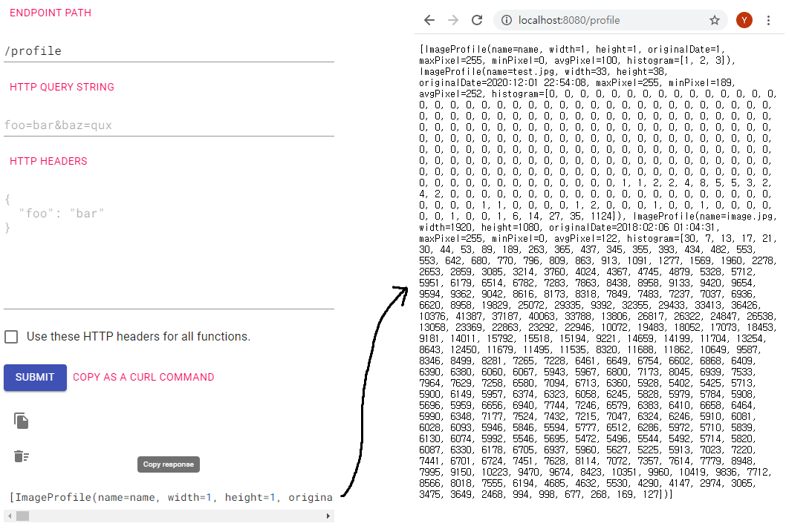
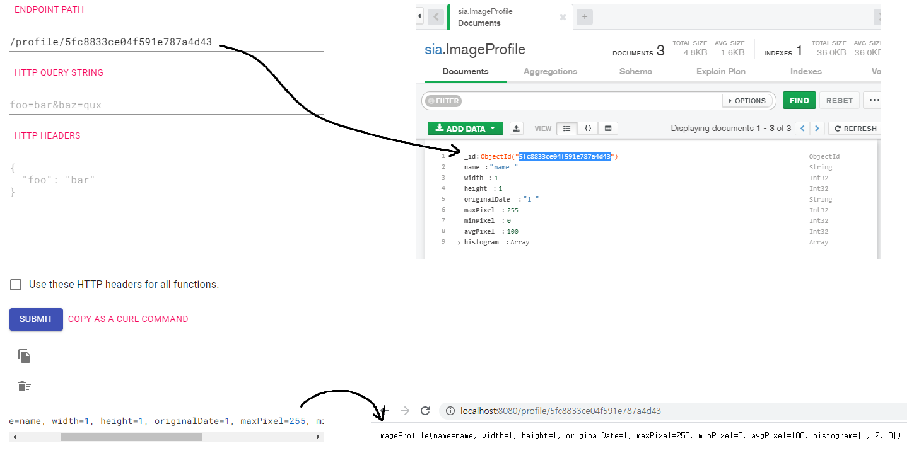
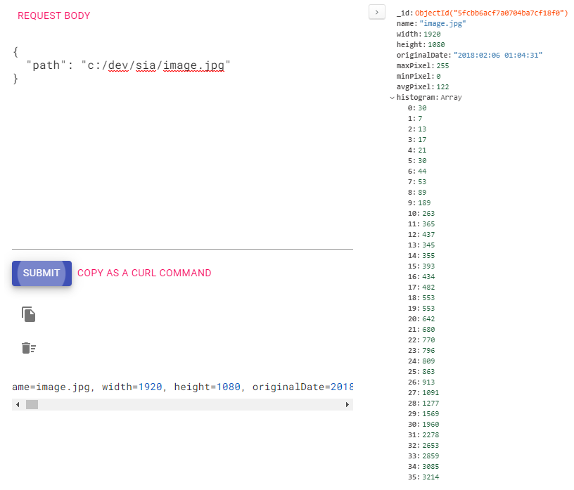
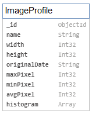

# Armeria Backend - Image Profile

## Armeria documentation service
- http://localhost:8080/docs

## 기능 및 결과

- [GET] http://localhost:8080/profile 
  - 모든 이미지의 프로필 불러오기 (메타 정보 및 픽셀 정보)

 

---

  

- [GET] http://localhost:8080/profile/id
  - 지정 ID 이미지의 프로필 불러오기 (메타 정보 및 픽셀 정보)
  

 

---

  

- [POST] http://localhost:8080/profile
  - 이미지 경로를 Body로 보내 이미지 프로필 저장
    - 한계 - Armeria Framework로 이미지 자체를 Body로 받아 저장하는 법을 찾지 못 함
      (Spring Framework의 MulitpartFile 로 받지 못함)
  - body - {"path" : "c:/dev/sia/test.jpg"}
  

 

## ERD

## 사용 기술 및 언어
- Kotlin
- Armeria Framework
- Spring-Boot Framework
- Mongo DB
- drewnoakes - metadata-extractor
- JUnit5
